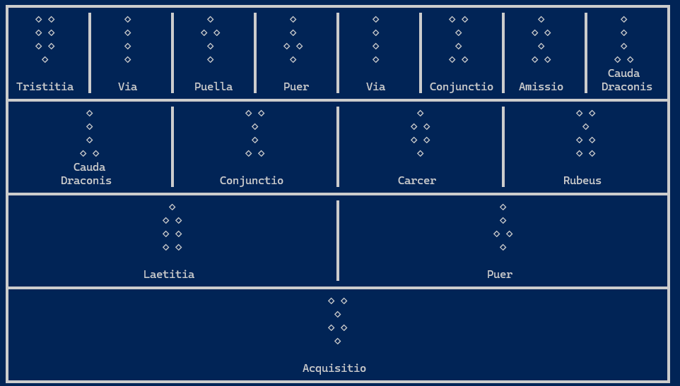
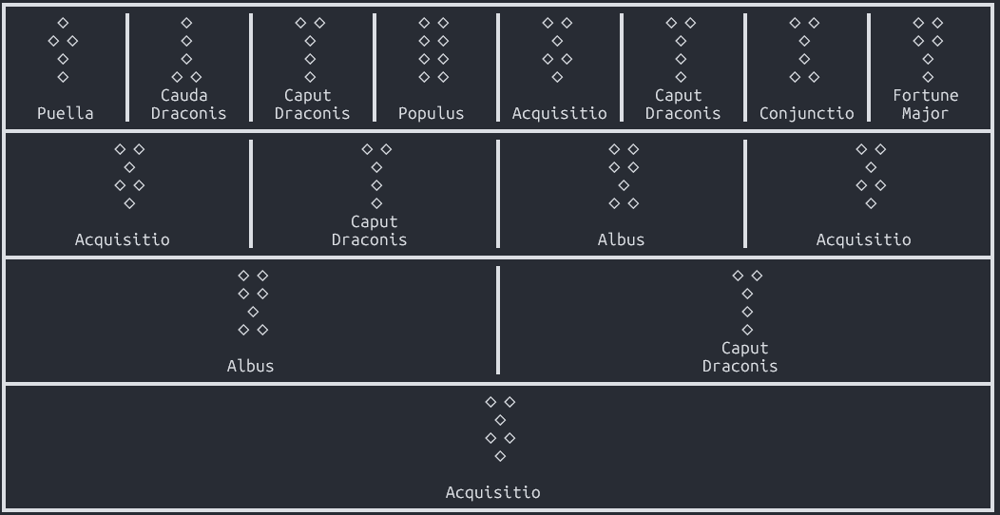

# geomancy-app

Geomancer App is a command-line tool for casting and interpreting traditional geomantic shield charts. It renders readings directly in your UTF-8 compatible terminal, combining classical symbolism with modern clarity. Interpretations are optionally enhanced through Gemini, drawing on planetary influences and age-old questions to illuminate each figure’s meaning

# Example Output

   Windows Powershell


   Linux Bash


## API Usage

This project uses the Google Gemini API for generating interpretations. To run this application, you will need your own API key.

1. Obtain an API key from Google AI Studio.
2. Set an evironment variable before running the application.
3. Set the GEMINI_API_KEY environment variable.

- On Unix like systems
```sh
export GEMINI_API_KEY="YOUR_API_KEY"
```
- On Windows
```sh
$env:GEMINI_API_KEY = "YOUR_API_KEY"
```
Note: Your use of the Gemini API is subject to the Google Generative AI API Terms of Service.

# Installation

Clone the repo and build:

- On Unix like systems
```sh
git clone https://github.com/jivetur-key/geomancy-app.git
cd geomancy-app
make
```
- On Windows
```sh
git clone https://github.com/jivetur-key/geomancy-app.git
cd geomancy-app
go build -o geomancer.exe .\main.go
```

# Usage
- invoking the application without any arguments generates and displays a shield reading
- For interpretation through gemini add the -planet switch with the name of the planet the question is related to.

```sh
./geomancer
./geomancer -planet sun
```
